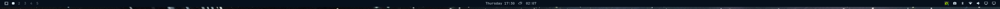
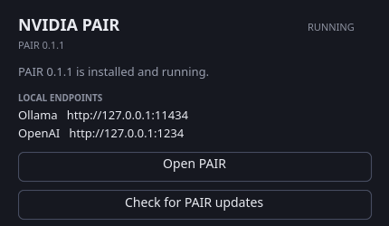
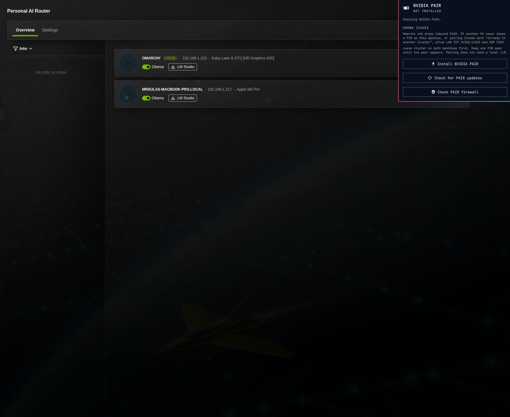

# NVIDIA PAIR for Omarchy

Install, update, and launch [NVIDIA Personal AI Router (PAIR)](https://github.com/NVIDIA/Personal-AI-Router) on [Omarchy](https://omarchy.org/).

PAIR is **not** NIM, Nemo, or a new inference engine. It is a local router that sits in front of Ollama or LM Studio and can send independent requests to other PAIR nodes on your LAN.

Omarchy is Arch-based. NVIDIA only ships a `.deb`. This plugin extracts that package into `~/.local`. Installing PAIR itself needs no `sudo`. Opening PAIR LAN ports in `ufw` does.





A live cluster after pairing Omarchy (Linux) with another machine:



## Install the plugin

```sh
omarchy plugin add https://github.com/mrdulasolutions/Omarchy-PAIR.git --enable
```

That clones into
`~/.config/omarchy/plugins/io.github.mrdulasolutions.pair/`
and places the official PAIR icon on the right side of the bar.

**Adding the plugin does not download PAIR.** Omarchy never runs plugin install hooks. Open the panel and click **Install NVIDIA PAIR**, or:

```sh
~/.config/omarchy/plugins/io.github.mrdulasolutions.pair/scripts/pair-ctl install
```

The first download is about 135 MB.

## Usage

This plugin is the **only** PAIR control in the Omarchy bar. NVIDIA’s Electron tray popup closes as soon as you leave the top bar on Hyprland, so the plugin hides that tray icon and owns the chip. Left-click is the tray’s working action: open or focus the PAIR window.

The chip’s status dot is a traffic light: **red** PAIR is down or missing, **yellow** running with no cluster peers, **green** running with at least one other node online.

| Action | What it does |
| --- | --- |
| Left click | Open / focus the PAIR app (or the helper panel if PAIR is not installed) |
| Right-click | Helper panel: cluster, install, update, firewall, known issues |
| Middle-click | Check GitHub for a newer PAIR app, or update it |
| **Install NVIDIA PAIR** | Download the latest NVIDIA release and unpack it into `~/.local/opt/PAIR` |
| **Launch / Open PAIR** | Start the desktop app, or focus it if it is already running |
| **Check for PAIR updates** | Ask GitHub for the latest `NVIDIA/Personal-AI-Router` release (shows up to date, or becomes **Update PAIR to …**) |
| **Update PAIR to …** | Replace the installed app with that newer release |
| **Known issues** | Pairing / ufw notes (hidden until you open this button) |
| Escape | Close the panel |

After PAIR is running, local apps should talk to:

| Engine | Endpoint |
| --- | --- |
| Ollama-compatible | `http://127.0.0.1:11434` |
| OpenAI / LM Studio | `http://127.0.0.1:1234` |

In the PAIR window, install Ollama (default) or LM Studio, add a model, and pair other machines with the six-digit PIN.

**Before pairing another PC**, open PAIR’s LAN ports. Omarchy’s firewall (`ufw`) defaults to deny incoming, so the other machine can see this node in discovery but cannot complete Add node. From the bar panel click **Allow PAIR on LAN**, or:

```sh
~/.config/omarchy/plugins/io.github.mrdulasolutions.pair/scripts/pair-ctl firewall
```

## Two different updates

There are two pieces of software. Update them separately.

### 1. This Omarchy plugin (the bar icon and installer)

```sh
omarchy plugin update io.github.mrdulasolutions.pair
```

Or update every git-managed plugin:

```sh
omarchy plugin update
```

That only `git pull`s this repository. It does **not** change the NVIDIA PAIR app.

### 2. The NVIDIA PAIR app

Do **not** use PAIR’s in-app **Settings → Service → Download update** on Omarchy. That updater expects Debian `apt` and `/opt/PAIR`.

Do **not** run `sudo apt install ./NVPAIR-Setup-*.deb`.

Use this plugin instead:

```sh
~/.config/omarchy/plugins/io.github.mrdulasolutions.pair/scripts/pair-ctl update
```

or click **Update PAIR** in the panel.

`pair-ctl install` / `update` only fetch the `.deb` listed in `releases.lock.json` (exact GitHub release URL, size, and SHA-256). A newer NVIDIA tag is reported by **Check for PAIR updates** but is not installed until this plugin is updated with a reviewed hash.

To install the pinned NVIDIA tag:

```sh
~/.config/omarchy/plugins/io.github.mrdulasolutions.pair/scripts/pair-ctl install
```

## What this plugin installs

All user-local, no root:

| Path | Role |
| --- | --- |
| `~/.local/opt/PAIR` | NVIDIA PAIR desktop app and services |
| `~/.local/bin/nvpair-desktop` | GUI launcher (Wayland) |
| `~/.local/bin/nvpair` | Terminal UI (`nvpair-tui`) |
| `~/.local/share/applications/nvpair.desktop` | App menu entry |
| `~/.local/state/omarchy-pair/installed.json` | Version this plugin installed |

Do not run `nvpair` (TUI) while the desktop app is open. They fight over the same ports.

## Hardware notes

PAIR itself does not need an NVIDIA GPU. A node without a GPU can still route requests to machines that have one.

Local inference still needs Ollama or LM Studio plus a model, and enough memory for that model. GeForce RTX 20-series and newer, RTX PRO, DGX Spark, and Apple M4+ are NVIDIA’s validated inference hardware.

## Known issues

These are pairing problems, not missing models. PAIR does **not** need a local LLM to add a node.

### Two PAIR icons in the top bar

NVIDIA PAIR’s Electron tray icon is unusable on Omarchy: its popup closes when you move off the top bar. Opening this plugin’s chip or helper adds NVIDIA’s tray id to `omarchy.tray.hidden` in `shell.json` so only this chip remains. That write happens on your click, not when the plugin loads.

### Linux never shows a PIN when another PC adds this node

Omarchy enables `ufw` with `DEFAULT_INPUT_POLICY=DROP`. NVIDIA PAIR listens on the LAN, but the firewall drops the other machine’s SYN packets.

Typical kernel log:

```
UFW BLOCK SRC=<other-pc> DST=<this-pc> DPT=14321
UFW BLOCK SRC=<other-pc> DST=<this-pc> DPT=14318
```

Discovery (mDNS) can still work, so the other PC lists this node, then pairing hangs or the PIN dialog never appears here.

Fix — allow the LAN only:

```sh
sudo ufw allow from 192.168.1.0/24 to any port 14318:14323 proto tcp comment 'NVIDIA PAIR'
sudo ufw allow from 192.168.1.0/24 to any port 5353 proto udp comment 'NVIDIA PAIR mDNS'
```

Replace `192.168.1.0/24` with your subnet, or run `pair-ctl firewall` and enter your sudo password. Ports: TCP `14318–14323` (inventory, pairing, engines) and UDP `5353` (mDNS).

### PIN dialog closes / “already in another cluster”

Clicking **Add node** on a machine **creates a new cluster** with only itself in it. If you start a second invite, close the PIN, or time out, that cluster is torn down and the next PIN is a different cluster. The other PC then reports that this node is already in another cluster.

- **Settings → Cluster → Leave** on **both** machines first (even if the list looks empty).
- Start **one** invite. Keep that PIN on the inviting machine until **Cluster** lists the peer.
- Do not reuse an old PIN. Do not close the PIN window when the other dialog closes — wait for the connected-node list.
- If the Mac sat unclustered for a while, fully quit and reopen PAIR there (NVIDIA known issue: macOS can stop answering LAN connections).

### Wrong IP / DHCP

Addresses move. Prefer the discovered hostname (`macbook.local`, `omarchy`) over a typed IP. Confirm with `ip neigh` / ping before retrying a stale address.

### Pairing is not an LLM problem

A node without a GPU, Ollama, or a downloaded model can still join a cluster and route. Install an engine only on machines that should **serve** requests.

### This Linux node shows up as `127.0.0.1` in the cluster

PAIR’s local member record can list `omarchy` at `127.0.0.1:14321` even while discovery advertises the LAN address. Peers still find the node over mDNS. If a Mac can pair but cannot send work *to* this PC, check that inventory port `14318` is allowed (same `pair-ctl firewall` rules).

### Ollama desktop steals port 11434

If chat works but PAIR **Jobs** stays empty, the Ollama *desktop app* is bound to `11434`. Quit it (including the tray icon), then toggle Ollama off and on in PAIR.

### In-app PAIR updater on Omarchy

**Settings → Service → Download update** expects Debian `apt` and `/opt/PAIR`. Use `pair-ctl update` instead.

## Remove

Remove the plugin (bar icon and installer):

```sh
omarchy plugin remove io.github.mrdulasolutions.pair
```

That does **not** uninstall NVIDIA PAIR, does **not** delete ufw rules, and does
**not** un-hide the NVIDIA tray entry in `~/.config/omarchy/shell.json`.
Remove the app with:

```sh
~/.config/omarchy/plugins/io.github.mrdulasolutions.pair/scripts/pair-ctl uninstall
```

Add `--purge` to also delete PAIR cluster identity and settings under
`~/.config/Nvidia Corporation/Personal AI Router`.
Model weights in `~/.ollama` / `~/.lmstudio` are never deleted.
ufw comments `NVIDIA PAIR` can be deleted with `sudo ufw status numbered` if you want the ports closed again.

If you already removed the plugin, delete the app by hand:

```sh
rm -rf ~/.local/opt/PAIR
rm -f ~/.local/bin/nvpair ~/.local/bin/nvpair-desktop
rm -f ~/.local/share/applications/nvpair.desktop
```

## Configure

```sh
omarchy bar move io.github.mrdulasolutions.pair --section right
```

## Development

This directory is the live plugin. Saving QML reloads it in `omarchy-shell`.

```sh
omarchy plugin validate ~/.config/omarchy/plugins/io.github.mrdulasolutions.pair
~/.config/omarchy/plugins/io.github.mrdulasolutions.pair/scripts/pair-ctl status --check-latest
omarchy-shell shell rescanPlugins
omarchy-shell shell summon io.github.mrdulasolutions.pair '{}'
```

| File | Role |
| --- | --- |
| `manifest.json` | Plugin contract |
| `BarWidget.qml` | Bar chip: official PAIR icon, live status, left-click opens PAIR |
| `Panel.qml` | Right-click helper: cluster nodes, install, update, firewall, known issues |
| `nvpair.png` | Official NVIDIA PAIR icon used in the bar |
| `Model.js` | Status JSON helpers |
| `scripts/pair-ctl` | Install / update / launch NVIDIA PAIR |
| `scripts/pathguard.py` | openat/no-follow path walk for install, writes, and delete |
| `releases.lock.json` | Pinned NVIDIA `.deb` URLs, sizes, and SHA-256 digests |
| `bar.png` | Top-bar screenshot |
| `NOTICE` | NVIDIA PAIR icon attribution |

## Marketplace listing

The repo is a normal Omarchy plugin: `manifest.json` at the root, `omarchy plugin validate` passes, MIT license, install/remove in this README, id `io.github.mrdulasolutions.pair`.

List it from the [plugin submit form](https://github.com/omacom/omarchy-plugin-marketplace/issues/new?template=submit-plugin.yml):

- Repository: `https://github.com/mrdulasolutions/Omarchy-PAIR.git`
- Category: **System**
- Tags (max three): **AI**, **Bar**, **System**
- Notes: user-local installer for NVIDIA PAIR. Installs only the `.deb` pinned in `releases.lock.json` (SHA-256 checked, archive members validated) into `~/.local/opt/PAIR` via an `openat`/`O_NOFOLLOW` parent walk (`scripts/pathguard.py`). `PAIR_HOME` is ignored. `pair-ctl firewall` is the only sudo path (visible terminal, LAN PAIR ports). Hiding NVIDIA’s tray icon writes `omarchy.tray.hidden` in `shell.json` only after you click the chip or open the panel. Does not edit Hyprland config. `nvpair.png` is NVIDIA’s app icon (see NOTICE).

## License

[MIT](LICENSE) for this plugin.

NVIDIA PAIR is a separate project under Apache-2.0.
See [NVIDIA/Personal-AI-Router](https://github.com/NVIDIA/Personal-AI-Router).
